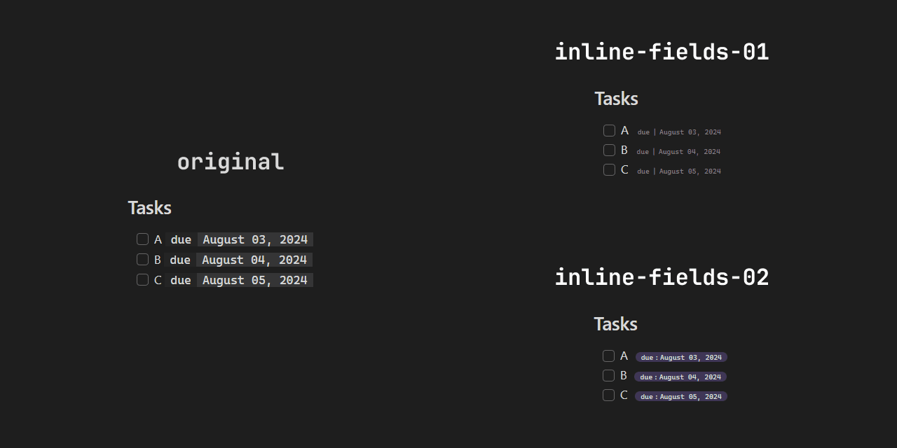
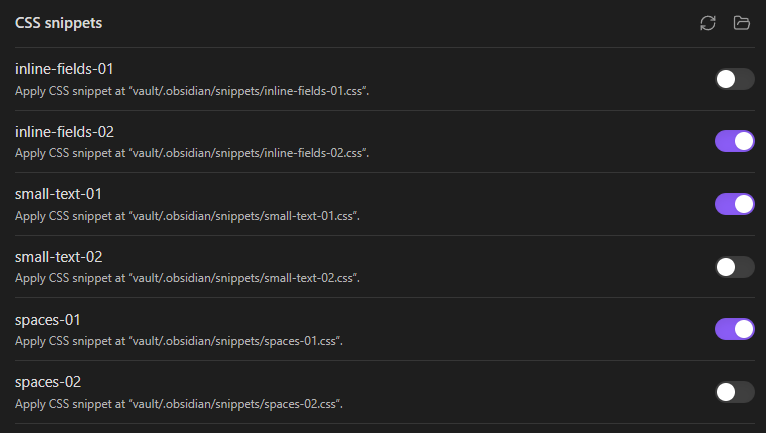

# Obsidian Dataview custom

A collection of Dataview snippets for Obsidian

## What is Dataview?

[Dataview](https://github.com/blacksmithgu/obsidian-dataview) is an index and query engine for your Obsidian workspace. You could create queries to list, filter, sort, or group your data.

## What are snippets?

Snippets are predefined codes that you can use to modify the appearance of your Obsidian workspace.

## How to install the snippets

- Download: Download the snippets located in [snippets](/snippets). You can download the whole folder or the one you want to use.
- Place: Save the downloaded files in the vault > .obsidian > snippets folder.
- Enable: Open Obsidian, go to "Settings", then "Appearance" and at the bottom you will find "CSS snippets", where you can enable the snippet you want to use.

### Available snippets

The available snippets allow you to modify the appearance of tables, lists, and tasks that were generated by Dataview.

They are configured to run on Obsidian's default theme. There might be some inconsistency with other themes.

You can see screenshots of the snippets [here](src/screenshots).

## Contributions

Your contributions are welcome! You can contribute by updating existing snippets or creating new ones. For more information, go to [CONTRIBUTING.md](CONTRIBUTING.md)
